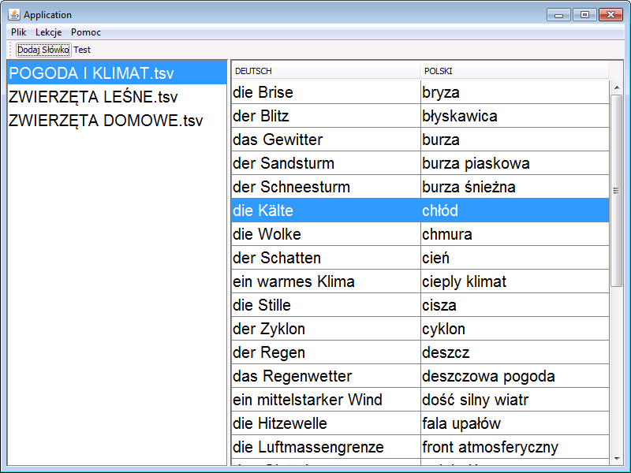
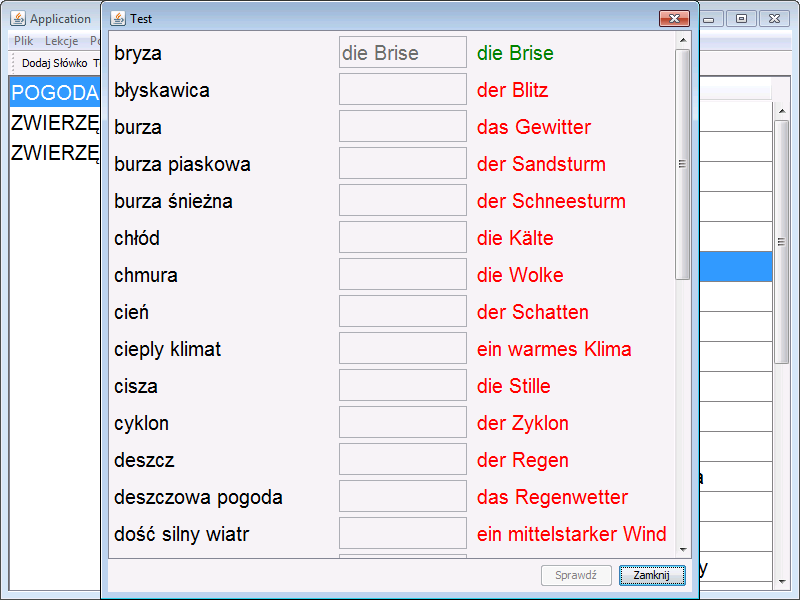

### Aplikacja
Program jest pomocą w nauce słówek w języku niemieckim. Pozwala tworzyć lekcje, dodawać do nich słowa i importować lekcje w postaci plików tsv (tab separated values). Pliki tsv można otworzyć w dowolnym edytorze tekstowym, a także w programie MS Excel.

### Instrukcje
Program oferuje funkcje takie jak:
- tworzenie lekcji (Lekcje -> Dodaj Lekcję)
- dodawanie słów do lekcji ("Dodaj Słowo" na pasku zadań lub CTRL+W)
- tworzenie testu z wybranej lekcji w osobnym oknie ("Test" na pasku zadań)

Przed pierwszym użyciem należy wybrać katalog, w którym zapisywane będą pliki z lekcjami.

